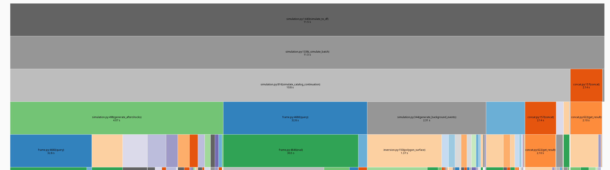
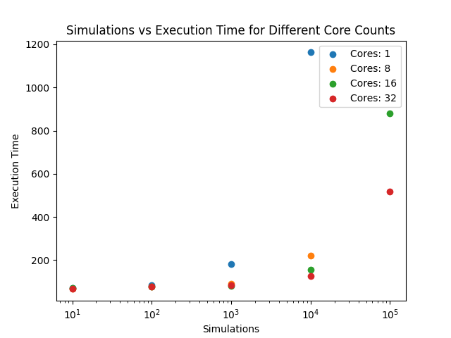

# ETAS Parallelization
Goal: improve the runtime of the ETAS model by leveraging parallelism.

The following approaches were considered.

1. Python built-in Multiprocessing
2. Numba
3. PyCOMPSs


## Bottlenecks
1. simulation
    - independent of each other, perfect for parallelization
2. optimize
3. preparation



## Findings

Tested with a slightly modified `run_entrypoint_sui.py` that loads the catalog from an XML file instead of downloading it.
For reference, included in the run_entrypoints folder.
With the catalog `full_catalog` [polybox link](https://polybox.ethz.ch/index.php/s/9CeKr2XvdnjyLds).

### Multiprocessing
Simple idea: Create a Pool of workers and distribute chunks of work to them.
For the simulation, each worker simulates a fraction of the total simulations.
Afterwards, all results are concatenated.

``` python
from concurrent.futures import ProcessPoolExecutor

with ProcessPoolExecutor(max_workers=workers) as executor:
    # split the work into chunks
    # ...
    for simulated_chunk in executor.map(
        simulate_chunk,
        simulation_counts,
        simulation_start_ids,
    ):
```
Alternatively, `multiprocessing.Pool` works similarily

Can be enabled with the `parallel` option for `model_parameters`.
For a value larger than 1, we try to use that many workers.
``` python
model_input = {
    # ...
    'model_parameters': {
        # ...
        "n_simulations": 10_000,
        "parallel": 8,
    },
}
```


For `n=1000` simulations we see a moderate improvement:
| processors | runtime[s] |
|------------|------------|
| 1          | 65         |
| 4          | 40         |
| 8          | 30         |

When scaling n we can see as expected an approximately linear relationship:
For `n=10_000` simulations it takes around 300s with 8 procs.


#### `self` rewrite
The processes have a quite large initial memory footprint (~1.5GB).
Python pickles data to load them in the new process.

Hypothesis: the `ETASSimulation` contains much data which is not needed for simulation.
If we only pass the required parameters, the overhead of spawning new processes (data is pickled for them) should be smaller.

Result: could not find an improvement.

<!-- (well for 1 core of course no improvement) -->
<!-- | cores,simulations | without `self` | with `self` | -->
<!-- |-------------------|----------------|-------------| -->
<!-- | 1, 1000           | 01:55          | 1:59        | -->
<!-- | 8, 1000           | 01:21          | 1:14        | -->
<!-- | 8, 10_000         | 04:59          | 04:58       | -->


#### chunksize
The `chunksize` determines how many simulations are performed in a batch.
Tweaking the chunksize can have large effects.
We found that the default value of 100 performs well.
For 10 or 1000, performance is worse.


### Numba
Strength: numerical code, `numpy` heavy

Weakness: python objects like dictionaries

- `@jit(nopython=True)`
    - just in time compiles the function
    - each function called must also be jitted
- the option `parallel=True` has the largest effect
    - all available cores are used.
- `@vectorize` 
    - applied to each row automatically without explicit loop, like numpy ufunc
    - tested with `ll_aftershock_term`

The package `numba-scipy` is required, s.t. numba is aware of the special scipy functions like `gamma`.

Notes:
rewrote `upper_gamma_ext` as `jitted_upper_gamma_ext` for compatibility with existing code.
Numbas typechecker complains if the same argument to a function has different types. E.g, just use `np.ndarray` instead of python lists.
For pandas series, make sure to operate on the numpy representation (`col.to_numpy()`).


<!-- | cores,simulations | with `numba` | without | -->
<!-- |-------------------|--------------|---------| -->
<!-- | 8, 100            | 00:57        | 01:06   | -->
<!-- | 8, 1000           | 02:12        | 2:16    | -->
<!-- | 8, 10_000           | 05:08        | 5:25    | -->

Conclusion: Small improvements for many manual adjustments.
We only implemented this for the inversion part.
The simulation has similar numeric code which could be targeted.
But then `parallel=True` wont be helpful if we already parallelize the simulations.

### PyCOMPSs
Idea: make `simulate_catalog_continuation` a task which can then be scheduled and run by the COMPSs runtime.

Challenges:
- could not directly run with the Docker environment.
- The official COMPSs image comes with an old python. Version conflict with ETAS dependencies, e.g. `seismostats`.
- Failed to install locally, also when building from source.

## Summary



E.g., for 10_000 simulations:

| core | runtime[s] |
|------|------------|
| 1    | 1162       |
| 32   | 125        |

Which is only a ~9.3 speedup.
But if we ignore the preprocessing (prepare/invert which takes about ~70s) which has to be done anyways and was only marginally optimized, we get an approximate speedup of:

(1162 - 70) / (125 - 70) ~ 19.85


## Miscellaneous

### Profiling
For profiling we used [cProfile](https://docs.python.org/3/library/profile.html)
and [SnakeViz](https://jiffyclub.github.io/snakeviz/) for visualization.

``` sh
# Generate profiling data and save it to a file
python -m cProfile -o debug.profile simulation_entry.py 
# Visualize it in the browser
snakeviz debug.profile
```
Profiling adds overhead so we should not compare performance without profiling with performance with profiling.

The following functions contribute much:
- `generate_aftershocks`
- `generate_background_events`
- Pandas queries

### Alternatives
- Python threads, makes sense for io bound programs, but limited by the GIL.
- [Ray](https://github.com/ray-project/ray) core distributed runtime, designed for AI workloads.
- Use multiple nodes, instead of one node.
  - e.g. with MPI

### pandas Performance
[Enhancing Pandas Performance](https://pandas.pydata.org/pandas-docs/stable/user_guide/enhancingperf.html)

> Generally, using Cython and Numba can offer a larger speedup than using pandas.eval() but will require a lot more code.

- `pandas.eval()` express queries at string to evaluate them at once on a dataframe (instead of evaluating each subquery independently)
  - already included
- Cython
    - would need to write many extensions for many functions for noticeable results.
- Operate on numpy representations (`df["col"].to_numpy()`) instead of the dataframe directly
- `engine="numba"`
    - which works only for some pandas method

### Memory Leaks
The simulated catalogs can grow large in size.
Filtering them at regular intervals (e.g. after a moderate chunksize) is important to not run out of memory.

### Running on leonardo
Limitation: could not get >8 cores.

Example setup:
``` sh
eval $(ssh-agent)
step login ssh
rsync -PravzHS <ETAS_PATH> <USER>@login.leonardo.cineca.it:~/etas

module load python/3.10.8--gcc--8.5.0

python -m venv env

source env/bin/activate

cd etas
pip install -e '.[hermes]'
# pip install pydantic

cd run_entrypoints
sbatch job_script
scontrol show job <JOB_ID>
 
```
Example `job_script`:
``` bash
#!/bin/bash

#SBATCH --nodes=1 
#SBATCH --ntasks-per-node=8
#SBATCH --time=1:00:00
#SBATCH --mem=16GB
#SBATCH --error=myJob.err
#SBATCH --output=myJob.out
#SBATCH --account=DTGEO_E1_1

module load python/3.10.8--gcc--8.5.0
source ../../env/bin/activate
python run_entrypoint_bench.py
```
